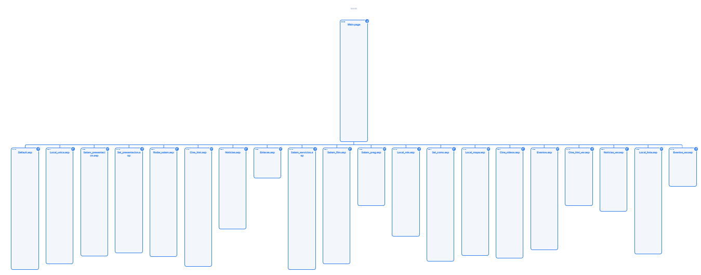
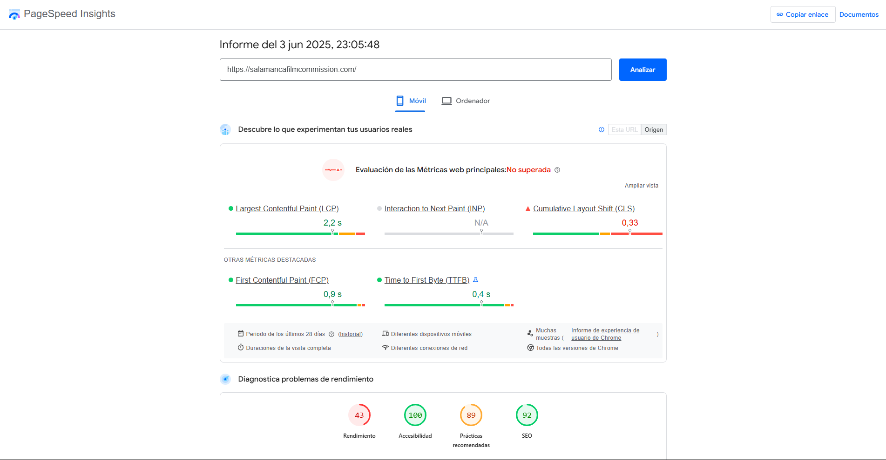
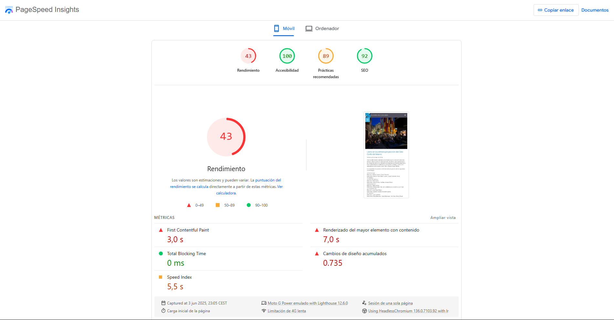
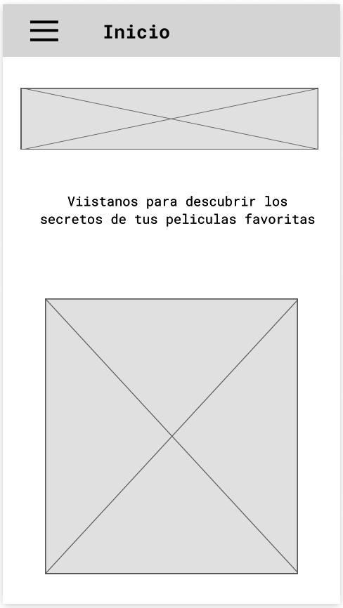
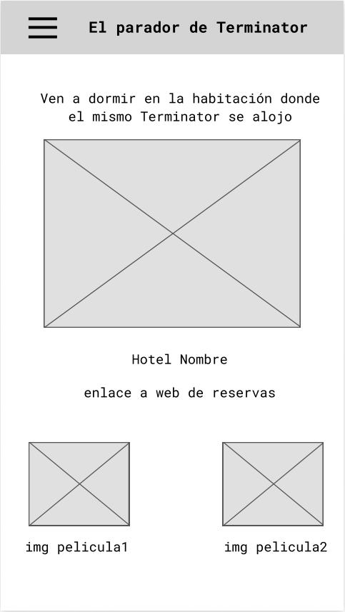
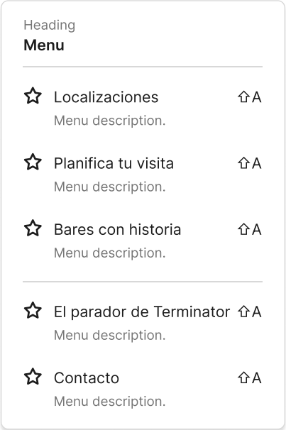

# Resumen ejecutivo
La página web de Salamanca Film Commission cumple adecuadamente con su función informativa, ofreciendo recursos valiosos para profesionales del sector audiovisual interesados en rodar en Salamanca. Sin embargo, presenta áreas de mejora en cuanto a **diseño visual**, **accesibilidad** y **experiencia de usuario**. La navegación es funcional, pero podría beneficiarse de una arquitectura de información más intuitiva y un diseño responsive optimizado. Se recomienda una revisión integral basada en principios de UX y accesibilidad para mejorar la eficacia y la satisfacción del usuario.

**Justificación como experto**: Este análisis se basa en los principios fundamentales de **Usability** y **User Experience Design**. Según la **Ley de Jakob** ([Laws of UX](https://lawsofux.com/jakobs-law/)), los usuarios pasan la mayor parte de su tiempo en otros sitios web, por lo que esperan que su sitio funcione de manera similar a todos los demás sitios que ya conocen. Las deficiencias identificadas violan expectativas básicas del usuario.

---

## Análisis Individual Profundo

### Diseño Visual y Coherencia Estética
El sitio utiliza una paleta de colores sobria y una tipografía legible, lo que facilita la lectura del contenido. Sin embargo, la estética general es algo anticuada, con un diseño que no refleja las tendencias actuales en diseño web. La coherencia visual entre las diferentes secciones es aceptable, aunque la inclusión de más elementos visuales, como imágenes de alta calidad y vídeos, podría enriquecer la experiencia del usuario.

**Principios UX aplicables**: 
- **Aesthetic-Usability Effect** ([Laws of UX](https://lawsofux.com/aesthetic-usability-effect/)): Los usuarios perciben los diseños estéticamente atractivos como más fáciles de usar. El diseño anticuado puede generar desconfianza en usuarios profesionales.
- **Law of Common Region** ([Laws of UX](https://lawsofux.com/law-of-common-region/)): Los elementos que están visualmente agrupados se perciben como relacionados. La falta de agrupación visual clara dificulta la comprensión de la estructura del contenido.

### Usabilidad y Navegación Intuitiva
La estructura del menú principal es clara, con categorías bien definidas como "Localizaciones", "Rodar en Salamanca" y "Noticias". No obstante, la navegación podría mejorarse mediante la implementación de **breadcrumbs** y un **buscador interno** para facilitar el acceso a la información. Además, algunos enlaces requieren múltiples clics para acceder a la información deseada, lo que puede afectar la eficiencia de la navegación.

**Justificación experta basada en principios establecidos**:
- **Miller's Rule** ([Laws of UX](https://lawsofux.com/millers-rule/)): La persona promedio solo puede mantener 7 (±2) elementos en su memoria de trabajo. La ausencia de breadcrumbs obliga al usuario a recordar su ubicación, sobrecargando la memoria de trabajo.
- **Three-Click Rule**: Aunque no es una ley absoluta, la mayoría de información crítica debería ser accesible en máximo 3 clics. Los múltiples clics requeridos violan las expectativas de eficiencia del usuario profesional.

Para un análisis más profundo de la usabilidad, y siguiendo las directrices del "Tema 5 Usabilidad", se podrían aplicar diversas técnicas de evaluación. La usabilidad se enfoca en la facilidad con la que los usuarios pueden aprender a usar un sistema, su eficiencia al usarlo, la facilidad para recordar cómo usarlo, la propensión a errores y la satisfacción subjetiva.

Dada la necesidad de un análisis más exhaustivo, se proponen las siguientes técnicas que, por motivos de tiempo en esta revisión inicial, quedan pendientes de realización:

* **Evaluación heurística:** Esta técnica permite identificar problemas de usabilidad al comparar la interfaz con un conjunto de principios reconocidos (heurísticas). Podría ser realizada por expertos en usabilidad para detectar fallos de diseño que impactan directamente en la eficiencia y satisfacción del usuario. Se podrían aplicar heurísticas de Nielsen como la visibilidad del estado del sistema, el control y libertad del usuario, y la prevención de errores.

**Principios relacionados**: Las **Heurísticas de Nielsen** son complementarias a los principios de [Laws of UX](https://lawsofux.com). Específicamente, la heurística de "Visibilidad del estado del sistema" se relaciona con el **Feedback Loop** - los usuarios necesitan saber dónde están y qué está pasando en todo momento.

* **Test de usuarios (think-aloud protocol):** Aunque más consumidor de tiempo, la observación directa de usuarios reales interactuando con la página revelaría problemas de navegación y comprensión que no son evidentes para los desarrolladores o evaluadores expertos. Se les pediría a los participantes que piensen en voz alta mientras realizan tareas específicas en la web.

**Justificación metodológica**: Según los principios de **User-Centered Design** de [52 Weeks of UX](https://52weeksofux.com), el diseño debe basarse en las necesidades reales del usuario, no en asunciones. El think-aloud protocol permite capturar el **modelo mental** real del usuario.

* **Encuestas de satisfacción (SUS - System Usability Scale):** Tras la interacción de los usuarios con la web, una encuesta estandarizada como el SUS proporcionaría una medida cuantitativa de la satisfacción subjetiva, permitiendo comparar la usabilidad percibida con benchmarks.

**Fundamento científico**: El SUS proporciona una métrica estandarizada que permite comparación con industry benchmarks. Según estudios, un score SUS >68 se considera above average, >80 excellent.

La implementación de estas técnicas permitiría obtener una visión más completa de los problemas de usabilidad, validando las observaciones iniciales y descubriendo otros aspectos críticos que podrían estar afectando la experiencia del usuario.

### Accesibilidad (WCAG Guidelines)
Según el análisis de la herramienta WAVE, la página presenta deficiencias en accesibilidad, a pesar de reportar un pase en WCAG AA y AAA.

**Errores de Contraste:**
* Se detecta **1 error de contraste muy bajo**, lo que dificulta la legibilidad para usuarios con baja visión. Es crucial revisar y ajustar la combinación de colores para asegurar un contraste adecuado entre el texto y el fondo.

**Principio fundamental violado**: Según las **Web Content Accessibility Guidelines (WCAG 2.1)**, el contraste mínimo debe ser 4.5:1 para texto normal y 3:1 para texto grande (Level AA). Esto no es solo una recomendación técnica, sino un **requisito legal** en muchas jurisdicciones y un principio ético fundamental del **Inclusive Design** promovido en [Cards for Humanity](https://cardsforhumanity.frog.co/).

**Alertas:**
* **No page regions (1):** Indica una falta de regiones de página (como `banner`, `main`, `navigation`, `contentinfo`), lo que puede dificultar la navegación para usuarios de lectores de pantalla.

**Justificación técnica**: Los **ARIA landmarks** proporcionan estructura semántica que permite a usuarios de tecnologías asistivas navegar eficientemente. Su ausencia viola el principio de **equidad en el acceso a la información**.

* **Redundant link (8):** Se encontraron 8 enlaces redundantes. Esto puede generar confusión y frustración para los usuarios, especialmente aquellos que navegan con teclado o lectores de pantalla. Se recomienda consolidar o revisar estos enlaces.

**Impacto en UX**: Según la **Ley de Hick** ([Laws of UX](https://lawsofux.com/hicks-law/)), el tiempo necesario para tomar una decisión aumenta con el número de opciones disponibles. Los enlaces redundantes incrementan innecesariamente las opciones, ralentizando la toma de decisiones del usuario.

**Características:**
* **Alternative text (12):** Aunque se identifican 12 textos alternativos, la presencia de errores de contraste y la falta de regiones de página sugieren que, si bien existen, su implementación podría no ser óptima o completa para todas las imágenes o elementos gráficos relevantes.
* **Linked image with alternative text (11):** Similar al punto anterior, se reconoce el uso de texto alternativo en imágenes con enlaces, lo cual es positivo, pero se debe verificar su precisión y utilidad para los usuarios de lectores de pantalla.
* **Language (1):** Se ha detectado la declaración del idioma, lo cual es una buena práctica de accesibilidad.
* **Heading level 1 (1):** La existencia de un encabezado de nivel 1 es fundamental para la estructura semántica de la página.

**ARIA:**
* **ARIA label (33):** Se utilizan 33 etiquetas ARIA, lo que es un buen indicativo de intentos de mejorar la accesibilidad para usuarios de lectores de pantalla. Sin embargo, la presencia de alertas como "No page regions" o "Redundant link" podría indicar que, a pesar de usar ARIA, su aplicación no resuelve completamente todos los problemas o que su uso no es siempre el más apropiado o eficiente. Es importante verificar que estas etiquetas sean precisas y útiles.
* **ARIA tabindex (15):** Se han implementado 15 `tabindex` ARIA. Esto puede ser útil para controlar el orden de tabulación, pero un uso excesivo o incorrecto puede generar problemas de navegación para los usuarios de teclado. Se debe asegurar que el orden de tabulación sea lógico y predecible.

**Principio de diseño violado**: El **exceso de ARIA** puede indicar un enfoque de "band-aid" en lugar de soluciones estructurales. Según las mejores prácticas de accesibilidad, el HTML semántico correcto es preferible a ARIA como solución de parche.

En resumen, la página presenta deficiencias notables en contraste y estructura de regiones, así como redundancia en enlaces, a pesar de un esfuerzo en el uso de textos alternativos y atributos ARIA. Es fundamental abordar estas áreas para mejorar la experiencia de los usuarios con discapacidades visuales o que utilizan tecnologías de asistencia. Se recomienda una auditoría exhaustiva de la implementación de ARIA y una revisión del diseño para asegurar el cumplimiento total de las pautas WCAG.

### Responsive Design
El sitio es parcialmente responsive; se adapta a diferentes tamaños de pantalla, pero la experiencia en dispositivos móviles no está completamente optimizada. Algunos elementos, como menús desplegables y formularios, no funcionan adecuadamente en pantallas pequeñas, lo que puede frustrar a los usuarios móviles.

**Principio UX violado**: **Fitts' Law** ([Laws of UX](https://lawsofux.com/fitts-law/)) establece que el tiempo para alcanzar un objetivo depende de la distancia y el tamaño del objetivo. En dispositivos móviles, los elementos deben ser suficientemente grandes (mínimo 44px según Apple HIG, 48dp según Material Design) para permitir interacción táctil precisa. Los elementos pequeños o mal optimizados violan este principio fundamental.

### Arquitectura de Información
La organización del contenido es lógica, pero podría beneficiarse de una jerarquía más clara y una mejor categorización. El sitemap del sitio, disponible en [https://octopus.do/wnknrzl2wo](https://octopus.do/wnknrzl2wo), clarifica la arquitectura de la información actual y ofrece una visión general de la estructura de la web.

Para optimizar y mejorar esta arquitectura, se podría aplicar la técnica de **Card Sorting**. Esta técnica permite a los usuarios organizar y agrupar el contenido de una manera que les resulte lógica e intuitiva. Por ejemplo, los usuarios podrían agrupar tarjetas que representen elementos como "Localizaciones", "Permisos de rodaje", "Noticias", "Contacto", etc., en categorías que ellos mismos definirían o que les serían preestablecidas. Esto ayudaría a validar o reestructurar las categorías existentes en la sección de "Localizaciones", subdividiéndolas en "Históricas", "Naturales" y "Urbanas" o en otras categorías que emerjan de la propia lógica del usuario.

**Justificación metodológica**: El **Card Sorting** es una técnica validada por la investigación en **Information Architecture**. Según los principios de [52 Weeks of UX](https://52weeksofux.com), el diseño debe reflejar el **modelo mental** del usuario, no la estructura organizacional interna. Esta técnica ayuda a alinear la arquitectura con las expectativas del usuario.

Adicionalmente, el **Content Labeling** (etiquetado de contenido) es crucial. Esto implica asegurar que los nombres de las categorías y subcategorías sean claros, concisos y comprensibles para los usuarios. Un etiquetado efectivo facilita que los usuarios encuentren la información deseada sin ambigüedades. La combinación de un Card Sorting con una revisión de los Content Labeling puede generar una arquitectura de información más centrada en el usuario y, por ende, una navegación más intuitiva y eficiente. Por limitaciones de tiempo en esta fase, la realización de un estudio de Card Sorting y una revisión exhaustiva del Content Labeling quedan pendientes.

**Principio de UX relacionado**: **Law of Prägnanz** ([Laws of UX](https://lawsofux.com/law-of-pragnanz/)) - las personas perciben objetos complejos de la forma más simple posible. Un etiquetado claro y categorización lógica reducen la complejidad cognitiva.

### Experiencia de Usuario (UX), Velocidad de Carga y Rendimiento
La experiencia de usuario es funcional pero carece de elementos interactivos que involucren al usuario. La implementación de funcionalidades como **mapas interactivos**, **recorridos virtuales** y **testimonios de producciones anteriores** podría mejorar significativamente la experiencia. Además, la inclusión de un **chatbot** o una sección de preguntas frecuentes más dinámica podría proporcionar asistencia inmediata a los usuarios.

**Justificación desde UX**: Según el **Peak-End Rule** ([Laws of UX](https://lawsofux.com/peak-end-rule/)), las personas juzgan una experiencia basándose en cómo se sintieron en su punto máximo y al final. Los elementos interactivos pueden crear "peaks" positivos que mejoren la percepción general de la experiencia.

La velocidad de carga es aceptable en conexiones de banda ancha, pero podría optimizarse significativamente. Para este análisis, se ha utilizado la herramienta **Google PageSpeed Insights**, que proporciona métricas detalladas y diagnósticos para mejorar el rendimiento web. Los resultados obtenidos (haciendo referencia a las imágenes `velocidad1.png` y `velocidad2.png` si estuvieran disponibles para una visualización más completa) revelan varias áreas de oportunidad:

**Principio fundamental**: Según estudios de **Google**, la probabilidad de rebote aumenta 32% cuando el tiempo de carga pasa de 1 a 3 segundos, y 90% cuando pasa de 1 a 5 segundos. La **velocidad es UX**.

**Diagnósticos Obtenidos:**

* **Evitar cambios de diseño importantes (15 cambios de diseño detectados):** Esto se refiere a "layout shifts" o cambios inesperados en el diseño de la página mientras se carga, lo que puede ser molesto para el usuario. Es crucial estabilizar los elementos durante la carga.

**Principio UX violado**: Los **Layout Shifts** crean una experiencia frustrante que viola el principio de **consistencia y predictibilidad**. Según las métricas de **Core Web Vitals**, un CLS >0.25 se considera "poor".

* **Habilita la compresión de texto (Ahorro potencial de 420 KiB):** La compresión GZIP o Brotli para archivos CSS, JavaScript y HTML puede reducir drásticamente el tamaño de los datos transferidos, mejorando la velocidad de carga.
* **Renderizado del mayor elemento con contenido (7000 ms):** Un tiempo de 7 segundos para que el elemento más grande de la página sea visible es considerable y puede generar una mala primera impresión en el usuario. Es fundamental optimizar la carga de este elemento crítico.

**Impacto en UX**: Un **LCP de 7 segundos** está muy por encima del umbral recomendado de 2.5 segundos. Esto viola gravemente las expectativas del usuario y puede causar abandono inmediato.

* **Reduce el contenido JavaScript que no se use (Ahorro potencial de 492 KiB):** Eliminar o aplazar la carga de código JavaScript que no es esencial para el contenido inicial reduce el tiempo de procesamiento y descarga.
* **Elimina los recursos que bloqueen el renderizado (Ahorro potencial de 1180 ms):** Archivos CSS y JavaScript que bloquean la renderización inicial deben ser optimizados para que no impidan que el contenido visible de la página se cargue rápidamente.
* **Minifica los recursos JavaScript (Ahorro potencial de 31 KiB):** Reducir el tamaño de los archivos JavaScript eliminando espacios en blanco y comentarios puede acelerar su descarga y parseo.
* **Publica imágenes con formatos de próxima generación (Ahorro potencial de 138 KiB):** Utilizar formatos de imagen modernos como WebP o AVIF en lugar de JPEG o PNG puede reducir el tamaño de los archivos sin sacrificar calidad.
* **Usa un tamaño adecuado para las imágenes (Ahorro potencial de 88 KiB):** Servir imágenes en las dimensiones exactas necesarias para el dispositivo del usuario evita la descarga de imágenes excesivamente grandes y luego escalarlas.
* **Reduce el contenido CSS que no se use (Ahorro potencial de 16 KiB):** Al igual que con JavaScript, eliminar CSS no utilizado puede reducir el tamaño de los archivos y mejorar el rendimiento.
* **No tiene una etiqueta `<meta name="viewport">` con width o initial-scale:** Esta etiqueta es crucial para asegurar que la página se adapte correctamente a diferentes tamaños de pantalla, especialmente en dispositivos móviles.

**Deficiencia crítica**: La ausencia de meta viewport viola los principios básicos de **responsive design** y es un error fundamental en desarrollo web moderno.

* **Precargar la imagen de renderizado del mayor elemento con contenido:** Indicar al navegador que priorice la carga de la imagen principal puede mejorar la velocidad de renderizado percibida.
* **Los elementos de imagen no tienen width y height explícitos:** Definir estas dimensiones ayuda a prevenir "layout shifts" y permite al navegador reservar espacio antes de que la imagen se cargue.
* **Minifica los archivos CSS (Ahorro potencial de 5 KiB):** Similar a JavaScript, minificar CSS reduce su tamaño.
* **Publica recursos estáticos con una política de caché eficaz (Se han encontrado 44 recursos):** Configurar políticas de caché adecuadas permite que los navegadores almacenen recursos estáticos localmente, evitando descargas repetidas.
* **Asegúrate de que el texto permanece visible mientras se carga la fuente web:** Evitar el "flash of unstyled text" (FOUT) o "flash of invisible text" (FOIT) mediante `font-display: swap` o técnicas similares.
* **No usa listeners pasivos para mejorar el desplazamiento:** Los "event listeners" pasivos pueden mejorar el rendimiento del desplazamiento, especialmente en dispositivos móviles.
* **Codifica las imágenes de forma eficaz (Ahorro potencial de 37 KiB):** Optimizar la calidad de compresión de las imágenes para encontrar un equilibrio entre tamaño de archivo y calidad visual.
* **Evitar document.write():** El uso de `document.write()` puede ralentizar el renderizado de la página.
* **Evita las animaciones no compuestas (2 elementos animados encontrados):** Las animaciones que no usan propiedades que pueden ser animadas directamente por el compositor del navegador pueden causar un rendimiento deficiente.
* **Evita encadenar solicitudes críticas (Se han encontrado 12 cadenas):** Reducir el número de recursos que deben cargarse secuencialmente para que la página sea interactiva.
* **Reducir el uso de código de terceros (El código de un tercero ha bloqueado el hilo principal durante 0 ms):** Aunque en este caso el bloqueo es de 0 ms, el diagnóstico resalta la importancia de monitorizar el impacto de scripts de terceros.
* **Evita tareas largas del hilo principal (1 tarea larga encontrada):** Tareas JavaScript largas pueden bloquear el hilo principal y hacer que la página no responda a la interacción del usuario.

La mejora de estas áreas de diagnóstico es crucial para optimizar la velocidad de carga y, por ende, la experiencia del usuario, especialmente en conexiones lentas o dispositivos móviles.

---

## Análisis Comparativo: Salamanca Film Commission vs. Film in Granada

### 1. Diseño Visual (Interfaz y Consistencia Estética)

| Criterio          | Salamanca Film Commission                                                                 | Film in Granada                                                                                                                                                                                                                                                                                                                                                                                                                                                                         |
| :---------------- | :---------------------------------------------------------------------------------------- | :---------------------------------------------------------------------------------------------------------------------------------------------------------------------------------------------------------------------------------------------------------------------------------------------------------------------------------------------------------------------------------------------------------------------------------------------------------------------- |
| Coherencia visual | Uso básico de colores planos y tipografías sin jerarquías marcadas. El diseño no transmite una narrativa visual clara. | Uso armónico de colores, tipografía consistente, buen contraste y elementos visuales alineados con el propósito cinematográfico.                                                                                                                                                                                                                                                                                                                                     |
| Identidad visual  | Escasa. El sitio se percibe como institucional sin rasgos diferenciales.                   | Fuerte identidad de marca. La estética comunica cultura visual y cine desde la portada.                                                                                                                                                                                                                                                                                                                                                                                          |
| Jerarquía visual  | Poco contrastada. No se distingue con claridad entre secciones principales y secundarias.   | Claramente estructurada. Las llamadas a la acción y títulos jerarquizados facilitan la lectura escaneada.                                                                                                                                                                                                                                                                                                                                                                        |

**Valoración general:**
→ Film in Granada está mejor diseñado visualmente. Aplica principios de **diseño emocional** y **affordance visual** (**Law of Common Region** y **Fitts' Law** de Laws of UX) que mejoran la percepción y orientación del usuario.

**Justificación experta**: Según el **Aesthetic-Usability Effect** ([Laws of UX](https://lawsofux.com/aesthetic-usability-effect/)), los usuarios perciben los diseños estéticamente atractivos como más fáciles de usar, incluso cuando no lo son objetivamente. Film in Granada aprovecha este efecto psicológico.

### 2. Organización de Tareas

| Criterio                                | Salamanca Film Commission                                                                                     | Film in Granada                                                                                                                                       |
| :-------------------------------------- | :------------------------------------------------------------------------------------------------------------ | :---------------------------------------------------------------------------------------------------------------------------------------------------- |
| Claridad en objetivos del sitio         | El propósito del sitio y los servicios no están explícitamente destacados; el usuario debe explorar para comprender. | El objetivo del sitio y su utilidad para productoras se entiende desde el primer vistazo gracias a textos directos e imágenes con contexto.            |
| Estrategia de llamadas a la acción      | Pocas llamadas visibles; enlaces textuales sin diseño prominente ni orientación a la acción.                  | Botones visuales prominentes con verbos orientados a tarea ("Solicita tu rodaje", "Explora localizaciones").                                         |
| Segmentación de perfiles de usuario     | No hay diferenciación clara entre usuarios como productores, técnicos o gestores institucionales.             | Presenta accesos diferenciados o información contextual para diferentes tipos de usuarios (guías, formularios, directorios específicos).             |

**Valoración general:**
→ Film in Granada presenta una **organización de tareas más efectiva**, guiando al usuario con intención clara. Aplica los principios de **reconocimiento sobre memorización** (heurística de Nielsen) y facilita la acción mediante un diseño proactivo.

**Principio UX aplicado**: **Goal-Gradient Effect** ([Laws of UX](https://lawsofux.com/goal-gradient-effect/)) - las personas se aceleran hacia una meta conforme se acercan a ella. Film in Granada facilita este efecto con CTAs claros y orientados a objetivos específicos.

### 3. Arquitectura de la Información

| Criterio                      | Salamanca Film Commission                                                                 | Film in Granada                                                                                                          |
| :---------------------------- | :---------------------------------------------------------------------------------------- | :------------------------------------------------------------------------------------------------------------------------ |
| Estructura del menú principal | Menú simple pero poco jerárquico. Las categorías carecen de subniveles bien definidos.     | Menú con estructura lógica, jerarquía clara y agrupación semántica orientada a tareas frecuentes del usuario.             |
| Profundidad de navegación     | Contenidos clave requieren más de 3 clics. Algunos accesos están ocultos en subpáginas.    | La mayoría de tareas se pueden realizar en 2 clics. Buena accesibilidad desde la portada a secciones operativas clave.   |
| Etiquetado y nomenclatura     | Uso de términos genéricos ("Rodar en Salamanca") sin indicaciones funcionales.             | Etiquetas claras, orientadas a objetivos ("Cómo rodar", "Guía profesional", "Rodado en Granada") con lenguaje directo.   |

**Valoración general:**
→ Film in Granada cuenta con una **arquitectura de información más clara**, profunda y eficiente. Refuerza la orientación del usuario mediante rutas de acceso optimizadas y nomenclatura alineada a la lógica de tareas.

**Principio UX violado en Salamanca**: **Miller's Rule** ([Laws of UX](https://lawsofux.com/millers-law/)) - la profundidad excesiva de navegación sobrecarga la memoria de trabajo del usuario.

### 4. Flujo de Navegación

| Criterio                       | Salamanca Film Commission                                                                 | Film in Granada                                                                                                             |
| :----------------------------- | :---------------------------------------------------------------------------------------- | :--------------------------------------------------------------------------------------------------------------------------- |
| Nivel de orientación           | No dispone de migas de pan (breadcrumbs); los retornos requieren uso del navegador.       | Incluye breadcrumbs y menús contextuales. Facilita saber en qué sección se encuentra el usuario y cómo volver.              |
| Fluidez del recorrido          | Navegación algo fragmentada; no siempre existe un recorrido continuo ni enlaces contextuales. | Flujo coherente, sin callejones sin salida. Todas las rutas tienen retornos claros y continuidad temática.                  |
| Compatibilidad y adaptación móvil | Adaptación parcial; algunos menús no son totalmente funcionales en dispositivos móviles.  | Responsive completo; navegación optimizada para móvil con menús colapsables y botones de tamaño adecuado para pulsación.     |

**Valoración general:**
→ Film in Granada proporciona un **flujo de navegación más fluido**, coherente y accesible en distintos dispositivos. Reduce la carga cognitiva (**Hick's Law**) y mejora la orientación contextual del usuario mediante navegación guiada.

**Principios UX aplicados**: 
- **Law of Proximity** ([Laws of UX](https://lawsofux.com/law-of-proximity/)): Los elementos relacionados están agrupados visualmente
- **Fitts' Law** ([Laws of UX](https://lawsofux.com/fitts-law/)): Elementos interactivos tienen el tamaño adecuado para interacción móvil

---
# Scope Canvas:

([Propuesta de valor ](TrabajoFinal_scope_canvas_5_print_es.pdf))

## Propósito

Convertir Salamanca en el primer destino de turismo cinematográfico interactivo de España, donde los visitantes descubran, experimenten y compartan la historia audiovisual de la ciudad a través de tecnología inmersiva.

## Usuarios

### Motivadores
* **Experiencias únicas:** Vivir momentos cinematográficos auténticos.
* **Conexión emocional:** Sentirse parte de las historias filmadas.
* **Contenido compartible:** Crear recuerdos dignos de redes sociales.
* **Descubrimiento cultural:** Conocer Salamanca desde una perspectiva cinematográfica.

### Dolores
* **Información dispersa:** Dificultad para encontrar datos sobre rodajes en Salamanca.
* **Experiencia pasiva:** Turismo tradicional sin interactividad cinematográfica.
* **Desconexión patrimonial:** No conocen la riqueza audiovisual de la ciudad.
* **Navegación compleja:** Web actual requiere múltiples clics para información básica.

### Necesidades
Nuestros usuarios necesitan o desean:
* Optimización web: Resolver deficiencias UX y accesibilidad identificadas.

## Objetivos (Organización)

### Corto Plazo
* **Plataforma funcional:** App con 50 localizaciones documentadas en 6 meses.
* **Contenido base:** 20 rutas cinematográficas temáticas operativas.
* **Alianzas estratégicas:** Partnerships con sector turístico y audiovisual local.

### Largo Plazo
* **Referente nacional:** Ser la Film Commission más innovadora en turismo cinematográfico.
* **Red autosostenible:** Ecosistema que autofinancie y producción.
* **Marca internacional:** "Salamanca Cinematográfica" reconocida globalmente.

## Acciones

Buscamos que los usuarios realicen las siguientes acciones concretas:
* **Planificar visita:** Usar la plataforma para organizar itinerarios cinematográficos antes del viaje.
* **Explorar localizaciones:** Visitar físicamente lugares de rodaje siguiendo rutas temáticas.
* **Generar contenido:** Fotografiar, grabar y compartir su experiencia en redes sociales.
* **Valorar experiencias:** Puntuar localizaciones y dejar reseñas para otros visitantes.
* **Consumir servicios:** Reservar restaurantes, alojamientos y actividades recomendadas.

## Métricas

Mediremos el éxito del proyecto a través de los siguientes indicadores:
* **Tráfico web/app**
* **Engagement rate**
* **Impacto económico:** €2M adicionales anuales en turismo local.
* **Satisfacción usuario:** NPS >50 y rating >4.2 estrellas.
* **Contenido generado:** 300 posts #Salamanca Cine mensuales.
* **Accesibilidad web:** WCAG AA compliance al 100%.

# Prototipo Lo-Fi

Como parte del desarrollo del concepto de turismo cinematográfico interactivo para Salamanca, se han diseñado dos bocetos para pantallas principales de la aplicación móvil, junto con el diseño del menú principal. La aplicación busca atraer turismo local promovido por el cine, ofreciendo una experiencia inmersiva que conecte a los visitantes con las localizaciones donde se han rodado películas y series en la ciudad.

Los bocetos incluyen:
- **Pantalla de inicio**: Diseñada para recibir al usuario con una interfaz atractiva que transmita inmediatamente el concepto de turismo cinematográfico
- **Pantalla temática "Terminator"**: Ejemplo de cómo se presentarían las experiencias relacionadas con rodajes específicos, en este caso la famosa película que utilizó Salamanca como locación
- **Menú de navegación**: Estructura de navegación principal que permite acceder a las diferentes funcionalidades de la aplicación

Estos diseños lo-fi representan la conceptualización inicial de una plataforma que pretende revolucionar la forma en que los turistas experimentan Salamanca, transformando la ciudad en un escenario interactivo donde cada rincón cuenta la historia de las producciones audiovisuales que allí se han filmado.

## Bocetos de la Aplicación

### Pantalla de Inicio

### Pantalla Temática - Terminator

### Menú de Navegación Principal

# Conclusión y Valoración Final de las Prácticas

Las prácticas de DIU25 han proporcionado una base sólida en el proceso de diseño UX, permitiendo aplicar una amplia gama de metodologías y herramientas. La estructura de las prácticas guio de manera efectiva a través de las fases clave de un proyecto UX, desde la investigación hasta la evaluación. La experiencia de diseñar y probar un producto propio fue invaluable.

Sin embargo, el análisis del caso real ("Salamanca Film Commission") ha revelado la importancia de la profundidad analítica y la vinculación con principios teóricos y herramientas de auditoría en un contexto profesional. Si bien en las prácticas se aplicaron metodologías, la justificación y el rigor detrás de cada decisión, así como la interpretación de los datos (ej. el SUS score de 70.0 en prácticas podría ser "Above Average" pero no "Excellent" según el benchmark), pueden ser más exhaustivos en un escenario real.

## Aspectos Aplicados de las Prácticas que fueron valiosos:

- **La creación de Personas y User Journeys** fue fundamental para entender al usuario, un paso que es igualmente crítico en el análisis de cualquier sitio web existente.

- **La realización de Usability Reviews y pruebas con usuarios** (SUS, Eye Tracking) es una práctica indispensable para obtener datos objetivos sobre la usabilidad, como se demostró en el análisis de los heatmap del caso B.

- **El diseño de Wireframes y Mockups** es esencial para la conceptualización y visualización del producto, un proceso que precede a la implementación de cualquier mejora propuesta en un sitio real.

## Aspectos del Caso Real que hubiera sido interesante aplicar en las Prácticas:

- **Auditorías de Accesibilidad y Rendimiento con herramientas específicas**: La aplicación de WAVE y Google PageSpeed Insights en el análisis real proporcionó diagnósticos concretos y accionables. Esto habría enriquecido el proceso de pruebas en las prácticas, permitiendo identificar problemas técnicos más allá de la usabilidad percibida.

- **Justificación de diseño basada en Leyes de UX**: Haber contextualizado cada decisión de diseño o problema identificado en las prácticas con leyes y principios de UX (ej. Ley de Hick, Fitts' Law) habría dotado al trabajo de una mayor solidez teórica y profesional.

- **Profundización en la Arquitectura de Información**: La propuesta de Card Sorting en el caso real destaca la importancia de una IA centrada en el usuario, un área que podría haberse explorado con mayor profundidad en las prácticas para validar el sitemap propuesto.

- **Análisis del impacto del Responsive Design con más detalle**: Aunque se consideró el responsive design en las prácticas, el análisis detallado de sus deficiencias (elementos pequeños, menús no funcionales) como en el caso real es crucial para una experiencia móvil óptima.

## Reflexión Final

En resumen, las prácticas han sido un excelente "campo de entrenamiento" para familiarizarse con el proceso UX. Para acercarse a un caso real, la clave reside en una mayor profundización en la justificación teórica, el uso intensivo de herramientas de auditoría para validar hipótesis, y una visión más estratégica que integre los objetivos de negocio desde las primeras fases del diseño. El proceso es un ciclo continuo de aprendizaje y adaptación, y esta experiencia ha sentado las bases para futuros desarrollos en el campo del diseño de interfaces de usuario.
